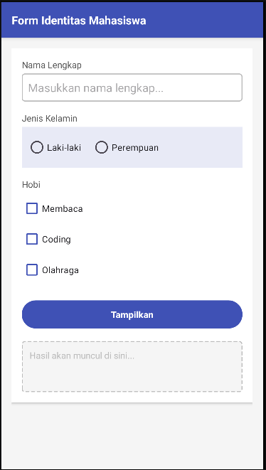

# T3-Mobile — Form Identitas Mahasiswa

**Tugas Praktikum 3 — Pemrograman Mobile**

---

## Identitas

| | |
|---|---|
| **Nama** | [AHMAD RAMADHANI R] |
| **NIM** | [F1D02310102] |

---

## Deskripsi Aplikasi

Aplikasi Android sederhana berupa **Form Identitas Mahasiswa**. Pengguna dapat mengisi:
- Nama Lengkap (EditText)
- Jenis Kelamin (RadioButton: Laki-laki / Perempuan)
- Hobi (CheckBox: Membaca, Coding, Olahraga)

Setelah menekan tombol **Tampilkan**, semua data yang diisi akan ditampilkan di TextView di bawah tombol.

---

## Layout yang Digunakan

| Layout | Posisi | Fungsi |
|---|---|---|
| `LinearLayout` (vertical) | Root / luar | Menyusun seluruh komponen secara vertikal |
| `RadioGroup` (horizontal) | Di dalam root | Menyusun RadioButton Laki-laki & Perempuan secara horizontal |

---

## Widget yang Digunakan

| Widget | ID | Fungsi |
|---|---|---|
| `EditText` | `etNama` | Input nama lengkap |
| `RadioGroup` | `rgJenisKelamin` | Grup pilihan jenis kelamin |
| `RadioButton` | `rbLakiLaki`, `rbPerempuan` | Pilihan jenis kelamin |
| `CheckBox` | `cbMembaca`, `cbCoding`, `cbOlahraga` | Pilihan hobi |
| `Button` | `btnTampilkan` | Tombol proses input |
| `TextView` | `tvHasil` | Menampilkan hasil input |

---

## Validasi

- Nama tidak boleh kosong → menampilkan error pada EditText
- Jenis kelamin harus dipilih → menampilkan Toast

---

## Screenshot

> 

---

## Cara Menjalankan

1. Clone repository ini
2. Buka dengan **Android Studio**
3. Jalankan di emulator atau device fisik (min. API 21)
